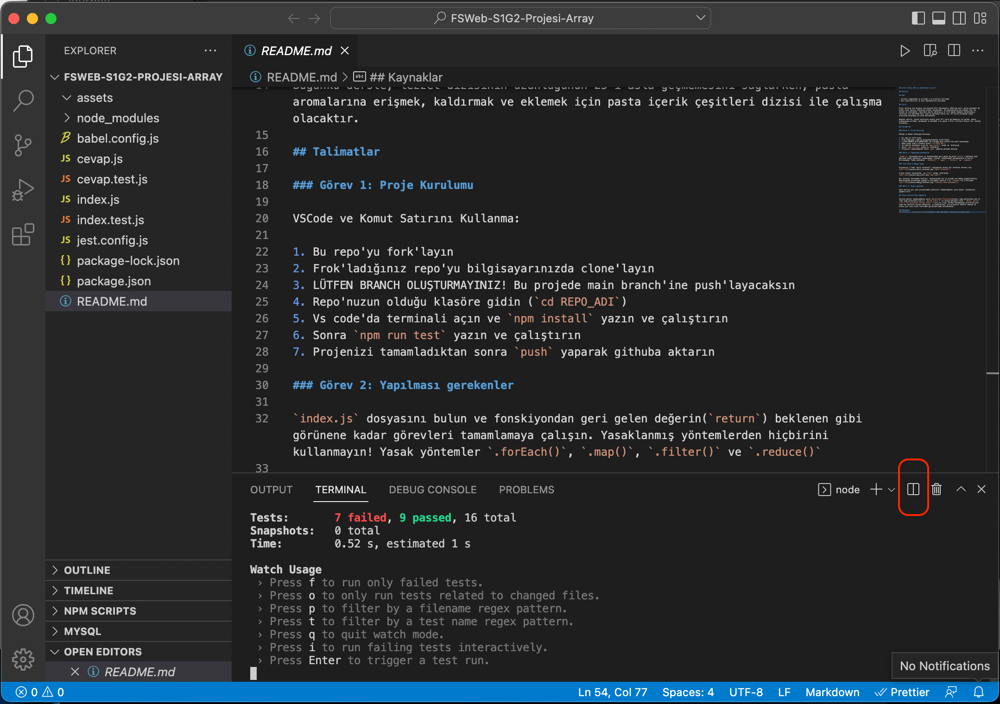
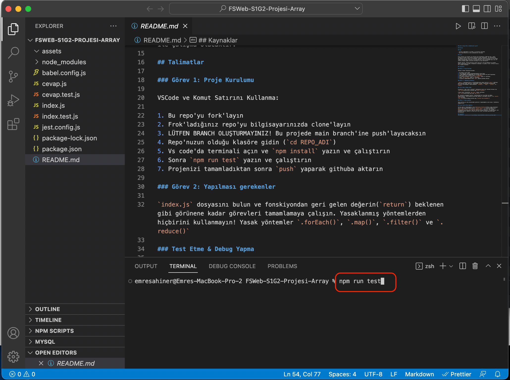
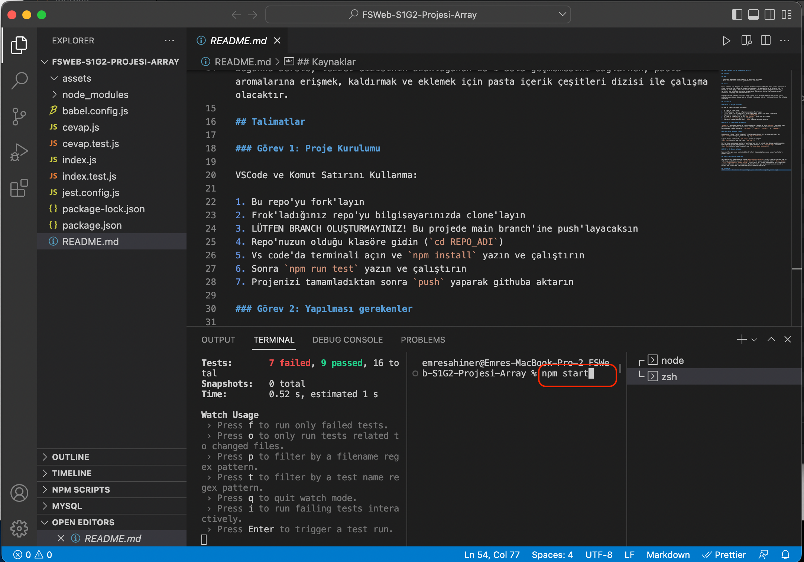
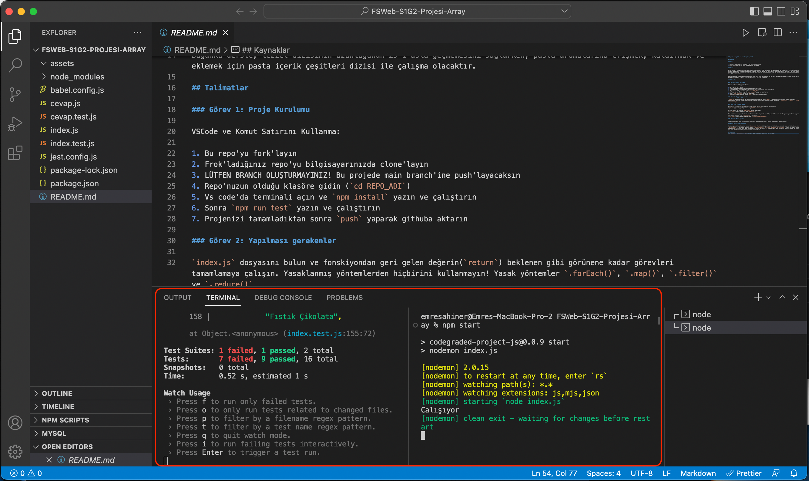

## JavaScript'e giriş

## Diziler

### Amaç

- Verileri depolamak ve erişmek için dizileri kullanmak
- Dizi özelliklerini ve dizi yöntemlerini kullanmak

## Giriş

Eşsiz tatları ile dünyaca üne kavuşan Elif Pastaneleri 1982'den beri, başta İstanbul'da olmak üzere farklı ülkelerde hizmet vermektedir. Bu pastanelerde değişmeyen tek şey lezzet ve ustalıktır. Nesilden nesile aktardığı ve Türk damak tadıyla harmanladığı tarifleri ile kalitede öncü olan bu markanın sırrı ise, 25 farklı aromanın uygun oranlarda karışımı ile elde edilmesidir.

Bugünkü derste, lezzet dizisinin uzunluğunun 25'i asla geçmemesini sağlarken, pasta aromalarına erişmek, kaldırmak ve eklemek için pasta içerik çeşitleri dizisi ile çalışma olacaktır.

## Talimatlar

### Görev 1: Proje Kurulumu

VSCode ve Komut Satırını Kullanma:

1. Bu repo'yu fork'la.
2. Fork'ladığın repo'yu bilgisayarında clone'la.
3. Bu projede `main` branch'ine push'layacaksın. LÜTFEN BRANCH OLUŞTURMA!
4. **Repo'nuzun olduğu klasöre gidin** (`cd repo_adi`)
5. Yeni bir dosya oluşturup; ".gitignore" olarak isimlendir. İçine sadece `node_modules/` yazıp.
6. Vs Code'da terminali açın ve `npm install` yazın ve çalıştırın. Bunu her projede sadece 1 kere yapacaksın.
7. Terminalde de, proje dizinindeyken, VS Code'da "split terminal"i tıklayarak ikinci bir terminal ekranı aç.
   - Sonra `npm run test` yaz ve çalıştır
   - Açılan ikinci terminalde `npm start` yazıp çalıştır.
8. Projeni tamamladıktan sonra `push` yaparak githuba aktar.

### Görev 2: Yapılması gerekenler

`index.js` dosyasını bul ve fonskiyondan geri gelen değerin(`return`) beklenen gibi görünene kadar görevleri tamamlamaya çalış.

`.forEach()`, `.map()`, `.filter()` ve `.reduce()` metodlarını kullanmak şimdilik _yasak_. Bu proje özelinde bunların hiçbirini **kullanma!**

### Test Etme & Debug

Projen klasöründeyken, VS Code'da "split terminal"i tıklayarak ikinci bir terminal ekranı aç.

Sonra `npm run test` yazın ve çalıştırın

Açılan ikinci terminalde `npm start` yazıp çalıştırın.

Split terminal ile ekranında testleri çalıştırırken bir diğerinde ise debug yapabileceksin. Kodlarında güncelleme yaptıkça ilerlemeyi kontrol için `console.log`'u kullanabilirsin.

### Görev 3: Bonus Çalışma

Sana verilen gün sonu projesindeki görevleri tamamladıktan, yine `index.js` sonundaki bonus çalışmaları yapmanı tavsiye ederiz.

## Proje Teslim Etme Adımları

Verilen görevi tamamladıktan sonra [Workintech Platformu](https://app.workintech.com.tr)'nda (app.workintech.com.tr) `Sprint 1>Gün 3`'ün sonuna eklenmiş olan "` Görev: Sprint 1'in 3. Gün projesini buraya yükle`" içeriğini açıp. GitHub hesabınızda oluşturduğunuz repo'nun adresini buraya ekleyiniz. Eğitmenlerimiz, gün projenizi kontrol edecek ve ertesi gün size slack üzerinden geribildirimde bulunacaklar.

## Kaynaklar

[W3 Schools - JavaScript Arrays](https://www.w3schools.com/js/js_arrays.asp)
